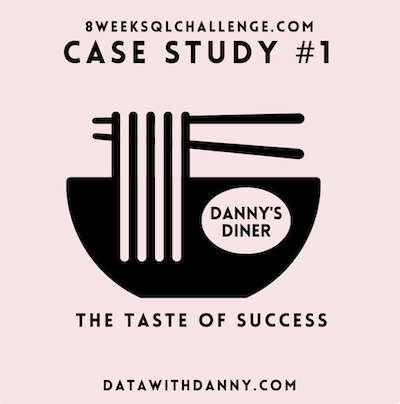
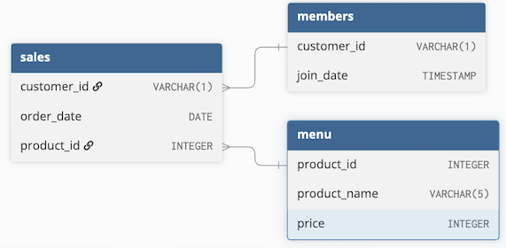

# September 8 - Danny's Diner


<!-- ## Table of Contents
1. [Business Problem](#business-problem)
2. [Tables and Data Structure](#tables-and-data-structure)
3. [Question and Solution](#question-and-solution) -->

## Business Problem
Danny has been operating his new restaurant for a few months. He wants to know if he should expand the current customer loyalty program based on the visiting and spending patterns of his customers, aiming to deliver a better and more personalized experience for loyalty members. [Jump to Final Insights](#final-advice)

## Tables and Data Structure


Note that the sales table has no primary key.

## Question and Solution
All queries are written in PostgreSQL.

Copy the solution code and execute on [DB Fiddle](https://www.db-fiddle.com/f/2rM8RAnq7h5LLDTzZiRWcd/138) to see the results!
***
### Brief Data Quality Check
1. Check missing values with SUM and CASE WHEN

```sql
SELECT
	SUM(CASE WHEN customer_id IS NULL THEN 1 ELSE 0 END) AS null_customer_ids,
    SUM(CASE WHEN order_date IS NULL THEN 1 ELSE 0 END) AS null_dates,
    SUM(CASE WHEN product_id IS NULL THEN 1 ELSE 0 END) AS null_product_ids
FROM sales;
```
__Explanation:__
* Use __SUM__ to aggregate null counts for each column. Nest a __CASE WHEN__ statement to increment 1 to the count every time NULL is encountered, and 0 otherwise.

Output:
| null_customer_ids | null_dates | null_product_ids |
| ----------------- | ---------- | ---------------- |
| 0                 | 0          | 0                |

There are no null values.

Using the same strategy to check the `menu` and `members` tables, it is discovered they have no missing values either.
***
2. Remove duplicates

```sql
WITH indexed_menu AS (
SELECT
  	*,
  	ROW_NUMBER() OVER(
    	PARTITION BY product_name, price
      	ORDER BY product_id ASC
    ) AS index
  	FROM menu
)
SELECT 
	*
FROM
	indexed_menu
WHERE 
	index = 1
ORDER BY
	product_id ASC
```
__Explanation:__
* Create a CTE with a new column `index` using ROW_NUMBER() to assign row numbers based on product_name and price. Entries with the same product_name and price will be assigned row numbers (1,2,3..) in ascending order of product_id.
* Select only entries with `index` 1 to guarantee only one instance exists for each restaurant product.

Output:
| product_id | product_name | price |
| ---------- | ------------ | ----- |
| 1          | sushi        | 10    |
| 2          | curry        | 15    |
| 3          | ramen        | 12    |

Use the same strategy on the `members` table remove entries with duplicate `customer_id` and `join_date`. 

The `sales` table is omitted because duplicate entries of its three columns `customer_id`, `product_id` and `order_date` could be cases of one customer ordering the same item multiple times on the same day.
***
### Case Study Questions
1. What is the total amount each customer spent at the restaurant?
```sql
SELECT 
	s.customer_id,
    SUM(m.price) AS spending
FROM
	sales s
INNER JOIN
	menu m
    ON s.product_id = m.product_id
GROUP BY
	s.customer_id
ORDER BY
	s.customer_id ASC;
```
__Explanation:__
* INNER JOIN the menu table to the sales table to connect `customer_id` to `price`.
* SUM the order prices of all customers and group result by `customer_id` to see the total spending of each customer.

Output:
| customer_id | spending |
| ----------- | -------- |
| A           | 76       |
| B           | 74       |
| C           | 36       |

Customer A and B spent the most at the restaurant with totals over $70. Customer C only spent $36, less than half the spending of customer A or B.
***
2. How many days has each customer visited the restaurant?
```sql
SELECT
	s.customer_id,
    COUNT(DISTINCT s.order_date) AS days_visited
FROM
	sales s
GROUP BY
	s.customer_id
ORDER BY
	s.customer_id ASC;
```
__Explanation:__
* Use COUNT DISTINCT to aggregate the total number of days each customer visited the restaurant.

Output:
| customer_id | days_visited |
| ----------- | ------------ |
| A           | 4            |
| B           | 6            |
| C           | 2            |

Customer B is the most frequent customer, visiting six days total.
***
3. What was the first item from the menu purchased by each customer?
```sql
WITH ranked AS (
    SELECT
        ROW_NUMBER() OVER (
            PARTITION BY customer_id 
            ORDER BY order_date ASC
        ) AS index,
        s.customer_id,
        s.product_id
    FROM 
        sales s
)
SELECT
    r.customer_id,
    m.product_name
FROM
    ranked r
INNER JOIN
    menu m
    ON r.product_id = m.product_id
WHERE 
    index = 1
ORDER BY
    customer_id ASC;
```
__Assumption:__ For multiple purchases on the same date, the first one encountered is assumed as first purchased.

__Explanation:__
* Create a new column `index` within a CTE `ranked` using ROW_NUMBER, grouping rows by `customer_id` and assigning number labels in ascending order of `order_date`. 
* INNER JOIN `menu` to the CTE and select the `customer_id` and `product_name` of all orders with `index` equal to 1.

Output:
| customer_id | product_name |
| ----------- | ------------ |
| A           | sushi        |
| B           | curry        |
| C           | ramen        |

From this sample, there seems to be no preference for first purchase. Each of the three menu items was picked exactly once by the three customers.
***
4. What is the most purchased item on the menu and how many times was it purchased by all customers?
```sql
WITH most_purchased_item AS (
    SELECT
    	s.product_id AS id,
    	COUNT(*) AS cnt
    FROM
    	sales s
    INNER JOIN
    	menu m
     	ON s.product_id=m.product_id
    GROUP BY
    	s.product_id, m.product_name
    ORDER BY
      	cnt DESC 
    LIMIT 1
)
SELECT
    s.customer_id,
    m.product_name,
    COUNT(*) AS number_of_purchases
FROM
    sales s
INNER JOIN
    menu m
    ON s.product_id=m.product_id
WHERE
    s.product_id = (SELECT id FROM most_purchased_item)
GROUP BY
    s.customer_id, m.product_name
ORDER BY
    customer_id ASC;
```
__Explanation:__
* Create a new column `cnt` in a CTE `most_purchased_item` by using COUNT grouped by `product_id` and `product_name`, and select the most popular product by ordering in descending `cnt` and limiting output to 1.
* Select all rows from `sales` inner joined to `menu` with `product_id` equal to the id of the most popular item in the CTE. Add a new column `number_of_purchases` using COUNT(*) to see how many times the most popular item was bought by each customer.

Output:
| customer_id | product_name | number_of_purchases |
| ----------- | ------------ | ------------------- |
| A           | ramen        | 3                   |
| B           | ramen        | 2                   |
| C           | ramen        | 3                   |

Ramen is the most popular food, purchased 8 times total and evenly split among all three customers.
***
5. Which item was the most popular for each customer?
```sql
WITH purchase_counts AS (
    SELECT
    	s.customer_id,
       	m.product_name,
        COUNT(*) AS cnt,
        DENSE_RANK() OVER(
          	PARTITION BY s.customer_id 
          	ORDER by COUNT(*) DESC
        ) AS rank
    FROM 
    	sales s
    INNER JOIN
      	menu m
      	ON s.product_id=m.product_id
    GROUP BY
    	s.customer_id, m.product_name
)
SELECT
    customer_id,
    product_name AS most_purchased_item,
    cnt AS number_of_times_purchased
FROM
    purchase_counts
WHERE
    rank = 1
ORDER BY
    customer_id ASC;
```
__Explanation:__
* Create a CTE `purchase_counts` with two new columns `cnt` using COUNT and `rank` using DENSE_RANK grouped by `customer_id` and ordered in descending COUNT.
* Select from the CTE the rows where `rank` is 1 (Most purchased product).

Output:
| customer_id | most_purchased_item | number_of_times_purchased |
| ----------- | ------------------- | ------------------------- |
| A           | ramen               | 3                         |
| B           | ramen               | 2                         |
| B           | curry               | 2                         |
| B           | sushi               | 2                         |
| C           | ramen               | 3                         |

While A and C purchased ramen the most, customer B purchased all items from the menu equally.
***
6. Which item was purchased first by the customer after they became a member?
```sql
WITH indexed AS (
    SELECT
    	s.customer_id,
      	m.product_name,
      	s.order_date,
        ROW_NUMBER() OVER (
            PARTITION BY s.customer_id 
            ORDER BY s.order_date ASC
        ) AS row_num
    FROM
    	sales s
    INNER JOIN
    	members me
        ON s.customer_id=me.customer_id
    INNER JOIN
      	menu m
      	ON s.product_id=m.product_id
    WHERE
    	me.join_date <= s.order_date
)
SELECT
    customer_id,
    product_name AS first_purchase_after_member,
    order_date
FROM
    indexed
WHERE
    row_num = 1
ORDER BY
    customer_id ASC;
```
__Assumption:__ For multiple purchases on the same date, the first one encountered is assumed as first purchased.

__Explanation:__
* Create a CTE `indexed` by INNER joining the `members` and `menu` table to `sales`. Create a new column `row_num` by using ROW_NUMBER, grouping rows by `customer_id` and ordered in ascending order date. Filter the CTE table by only rows with an order date on or after member join date.
* Select from the CTE all rows with `row_num` equal to 1, indicating the first purchase.

Output:
| customer_id | first_purchase_after_member | order_date |
| ----------- | --------------------------- | ---------- |
| A           | curry                       | 2021-01-07 |
| B           | sushi                       | 2021-01-11 |

A bought curry after becoming a member, while B bought sushi.
***
7. Which item was purchased just before the customer became a member?
```sql
WITH indexed AS (
    SELECT
    	s.customer_id,
      	m.product_name,
      	s.order_date,
        ROW_NUMBER() OVER (PARTITION BY s.customer_id ORDER BY s.order_date DESC) AS row_num
    FROM
    	sales s
    INNER JOIN
    	members me
        ON s.customer_id=me.customer_id
    INNER JOIN
    	menu m
        ON s.product_id=m.product_id
    WHERE
    	me.join_date > s.order_date
    )
SELECT
    customer_id,
    product_name AS last_purchase_before_member,
    order_date
FROM
    indexed i
WHERE
    row_num = 1
ORDER BY
    customer_id ASC;
```
__Assumption:__ For multiple purchases on the same date, the first one encountered is assumed as first purchased.

__Explanation:__
* Same logic as previous question, but `row_num` is calculated in descending `order_date` instead of ascending, and the CTE is filtered by only rows with an order date before the member join date.
* `row_num`=1 now indicates the latest purchase before becoming a member.

Output:
| customer_id | last_purchase_before_member | order_date |
| ----------- | --------------------------- | ---------- |
| A           | sushi                       | 2021-01-01 |
| B           | sushi                       | 2021-01-04 |

Both customers A and B bought sushi before becoming a member.
***
8. What is the total items and amount spent for each member before they became a member?
```sql
WITH filtered AS (
    SELECT
    	s.customer_id,
      	m.product_name,
        m.price,
      	s.order_date
    FROM
    	sales s
    INNER JOIN
    	members me
        ON s.customer_id=me.customer_id
    INNER JOIN
    	menu m
        ON s.product_id=m.product_id
    WHERE
    	me.join_date > s.order_date
)
SELECT
    customer_id,
    SUM(price) AS total_spent,
    COUNT(*) AS total_items_purchased
FROM
    filtered
GROUP BY
    customer_id
ORDER BY
    customer_id ASC;
```
__Explanation:__
* Create a CTE `filtered` by INNER joining the `members` and `menu` tables, filtering to only rows with an order date before the member join date.
* From this CTE, select `customer_id` and two new columns `total_spent` with SUM of price and `total_items_purchased` with COUNT.

Output:
| customer_id | total_spent | total_items_purchased |
| ----------- | ----------- | --------------------- |
| A           | 25          | 2                     |
| B           | 40          | 3                     |

Bringing back the total spending calculations from earlier (A: $76) and (B: $74), most of A's spending occurred after becoming a member, and almost half of B's ($34).
***
9. If each $1 spent equates to 10 points and sushi has a 2x points multiplier - how many points would each customer have?
```sql
WITH point_calculation AS (
    SELECT
    	s.customer_id,
        m.product_name,
        m.price,
        CASE
        	WHEN m.product_name = 'sushi' THEN m.price * 20
            ELSE m.price * 10
        END AS points
    FROM 
    	sales s
    INNER JOIN
    	menu m 
        ON s.product_id=m.product_id
    )
SELECT
    customer_id,
    SUM(points) AS total_points
FROM
    point_calculation 
GROUP BY
    customer_id
ORDER BY
    customer_id ASC;
```
__Explanation:__
* Create a CTE `point_calcualtion` with a new column `points`, which calculates the point value of each order item. Use CASE WHEN to assign `price` times 20 for sushi and `price` times 10 for all other menu items.
* Select from `point_calculations` the `customer_id` and a new column `total_points` using SUM of the points column, grouped by `customer_id`.

Output:
| customer_id | total_points |
| ----------- | ------------ |
| A           | 860          |
| B           | 940          |
| C           | 360          |

Customer A and B have the most points, being the customers in the sample with the most spending and items purchased.
***
10. In the first week after a customer joins the program (including their join date) they earn 2x points on all items, not just sushi - how many points do customer A and B have at the end of January?
```sql
WITH point_calculation AS (
    SELECT
    	s.customer_id,
        m.product_name,
        m.price,
        s.order_date,
        CASE
        	WHEN 
            	m.product_name = 'sushi' OR
                (s.order_date - me.join_date <= 7 AND
                s.order_date - me.join_date >= 0) THEN m.price * 20
            ELSE m.price * 10
        END AS points
    FROM 
    	sales s
    INNER JOIN
    	members me
        ON s.customer_id=me.customer_id
    INNER JOIN
    	menu m 
        ON s.product_id=m.product_id
    WHERE
      	EXTRACT(MONTH FROM s.order_date) = 1
    )
SELECT
    customer_id,
    SUM(points) AS total_points
FROM
    point_calculation
GROUP BY
    customer_id
ORDER BY
    customer_id ASC;
```
__Explanation:__
* Same logic as previous question, but the CASE WHEN logic for the `points` column is changed so that `price` times 20 is not only assigned to sushi but also rows with an order-date within a week past the member join date. `point_calculation` is also now filtered to only rows in month 1 (Jan), using EXTRACT.

Output:
| customer_id | total_points |
| ----------- | ------------ |
| A           | 1370         |
| B           | 940          |

With this new points calculation, customer A has significantly more points than B. B's points calculation is also the same as before. Thus, customer A made plenty of purchases in the week after becoming a member, while B did not make any.
***
### Final Advice
* From the given sample, it can be inferred ramen is the most popular restaurant item. Thus, restaurant __promotion should highlight ramen__ as its most delicious food.
* The points system can be a good way to encourage customers to spend more after becoming loyalty members. But there should be an __incentive for gathering points__, such as redeeming discount coupons at different point thresholds.
* Providing a __larger customer sample__ for analysis is advised, as the conclusions drawn from a sample of only three customers are extremely limited.
***
### Extra Questions
1. Join `sales`, `menu` and `members` into a single table with the fields `customer_id`, `order_date`, `product_name`, `price`, and `member` (Y/N).
```sql
SELECT
    s.customer_id,
    s.order_date,
    m.product_name,
    m.price,
    CASE
        WHEN (me.join_date IS NULL OR me.join_date > order_date) THEN 'N'
        ELSE 'Y'
    END AS member
FROM 
    sales s
LEFT JOIN
    members me
    ON s.customer_id=me.customer_id
INNER JOIN
    menu m
    ON s.product_id=m.product_id
ORDER BY
    s.customer_id ASC, order_date ASC;
```
Output:
| customer_id | order_date | product_name | price | member |
| ----------- | ---------- | ------------ | ----- | ------ |
| A           | 2021-01-01 | sushi        | 10    | N      |
| A           | 2021-01-01 | curry        | 15    | N      |
| A           | 2021-01-07 | curry        | 15    | Y      |
| A           | 2021-01-10 | ramen        | 12    | Y      |
| A           | 2021-01-11 | ramen        | 12    | Y      |
| A           | 2021-01-11 | ramen        | 12    | Y      |
| B           | 2021-01-01 | curry        | 15    | N      |
| B           | 2021-01-02 | curry        | 15    | N      |
| B           | 2021-01-04 | sushi        | 10    | N      |
| B           | 2021-01-11 | sushi        | 10    | Y      |
| B           | 2021-01-16 | ramen        | 12    | Y      |
| B           | 2021-02-01 | ramen        | 12    | Y      |
| C           | 2021-01-01 | ramen        | 12    | N      |
| C           | 2021-01-01 | ramen        | 12    | N      |
| C           | 2021-01-07 | ramen        | 12    | N      |
***
2. Add a new column `rank` to the new joined table, assigning numeric labels to orders made by loyalty members ranked by ascending order_date.
```sql
WITH initial AS (
    SELECT
        s.customer_id,
        s.order_date,
        m.product_name,
        m.price,
        CASE
          WHEN (me.join_date IS NULL OR me.join_date > order_date) THEN 'N'
            ELSE 'Y'
        END AS member,
        ROW_NUMBER() OVER(PARTITION BY 1) as index
    FROM 
        sales s
    LEFT JOIN
        members me
        ON s.customer_id=me.customer_id
    INNER JOIN
        menu m
        ON s.product_id=m.product_id
    ORDER BY
        s.customer_id ASC, order_date ASC
)
SELECT 
    customer_id,
    order_date,
    product_name, 
    price,
    member,
    CASE
        WHEN member = 'N' THEN NULL
        ELSE RANK() OVER(
            PARTITION BY customer_id, member
            ORDER BY order_date
        )
    END AS rank
FROM
    initial 
```
Output:
| customer_id | order_date | product_name | price | member | rank |
| ----------- | ---------- | ------------ | ----- | ------ | ---- |
| A           | 2021-01-01 | sushi        | 10    | N      |      |
| A           | 2021-01-01 | curry        | 15    | N      |      |
| A           | 2021-01-07 | curry        | 15    | Y      | 1    |
| A           | 2021-01-10 | ramen        | 12    | Y      | 2    |
| A           | 2021-01-11 | ramen        | 12    | Y      | 3    |
| A           | 2021-01-11 | ramen        | 12    | Y      | 3    |
| B           | 2021-01-01 | curry        | 15    | N      |      |
| B           | 2021-01-02 | curry        | 15    | N      |      |
| B           | 2021-01-04 | sushi        | 10    | N      |      |
| B           | 2021-01-11 | sushi        | 10    | Y      | 1    |
| B           | 2021-01-16 | ramen        | 12    | Y      | 2    |
| B           | 2021-02-01 | ramen        | 12    | Y      | 3    |
| C           | 2021-01-01 | ramen        | 12    | N      |      |
| C           | 2021-01-01 | ramen        | 12    | N      |      |
| C           | 2021-01-07 | ramen        | 12    | N      |      |
***
Note: The context of this case study is sourced from the [challenge website](https://8weeksqlchallenge.com/case-study-1/) by Danny Ma.