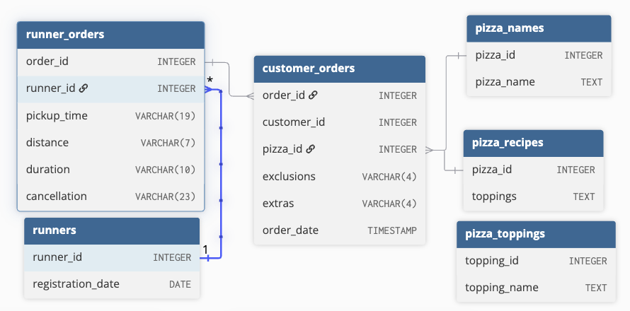

# September 15 - Pizza Runner


## Business Problem
Danny has opened a pizza uber. He wants insights on his customers and currently employed runners. [Jump to Final Insights](#final-advice)

## Tables and Data Structure


Note that the sales table has no primary key.

## Question and Solution
All queries are written in PostgreSQL.

Copy the solution code and execute on [DB Fiddle](https://www.db-fiddle.com/f/7VcQKQwsS3CTkGRFG7vu98/65) to see the results!
***
### Data Cleaning
1. customer_orders table

```sql
CREATE TEMP TABLE clean_customer_orders AS (
SELECT
	order_id, 
    customer_id, 
    pizza_id,
    CASE 
    	WHEN exclusions = '' OR exclusions = 'null' THEN NULL
        ELSE exclusions
    END AS exclusions,
	CASE 
    	WHEN extras = '' OR extras = 'null' THEN NULL
        ELSE extras
    END AS extras,
    order_time
FROM
	customer_orders
);
```
__Explanation:__
* Use true NULL to represent all empty entries in the columns `exclusions` and `extras`.

__BEFORE__:
| order_id | customer_id | pizza_id | exclusions | extras | order_time          |
| -------- | ----------- | -------- | ---------- | ------ | ------------------- |
| 1        | 101         | 1        |            |        | 2020-01-01 18:05:02 |
| 2        | 101         | 1        |            |        | 2020-01-01 19:00:52 |
| 3        | 102         | 1        |            |        | 2020-01-02 23:51:23 |
| 3        | 102         | 2        |            |        | 2020-01-02 23:51:23 |
| 4        | 103         | 1        | 4          |        | 2020-01-04 13:23:46 |
| 4        | 103         | 1        | 4          |        | 2020-01-04 13:23:46 |
| 4        | 103         | 2        | 4          |        | 2020-01-04 13:23:46 |
| 5        | 104         | 1        | null       | 1      | 2020-01-08 21:00:29 |
| 6        | 101         | 2        | null       | null   | 2020-01-08 21:03:13 |
| 7        | 105         | 2        | null       | 1      | 2020-01-08 21:20:29 |
| 8        | 102         | 1        | null       | null   | 2020-01-09 23:54:33 |
| 9        | 103         | 1        | 4          | 1, 5   | 2020-01-10 11:22:59 |
| 10       | 104         | 1        | null       | null   | 2020-01-11 18:34:49 |
| 10       | 104         | 1        | 2, 6       | 1, 4   | 2020-01-11 18:34:49 |

__AFTER__:
| order_id | customer_id | pizza_id | exclusions | extras | order_time          |
| -------- | ----------- | -------- | ---------- | ------ | ------------------- |
| 1        | 101         | 1        |            |        | 2020-01-01 18:05:02 |
| 2        | 101         | 1        |            |        | 2020-01-01 19:00:52 |
| 3        | 102         | 1        |            |        | 2020-01-02 23:51:23 |
| 3        | 102         | 2        |            |        | 2020-01-02 23:51:23 |
| 4        | 103         | 1        | 4          |        | 2020-01-04 13:23:46 |
| 4        | 103         | 1        | 4          |        | 2020-01-04 13:23:46 |
| 4        | 103         | 2        | 4          |        | 2020-01-04 13:23:46 |
| 5        | 104         | 1        |            | 1      | 2020-01-08 21:00:29 |
| 6        | 101         | 2        |            |        | 2020-01-08 21:03:13 |
| 7        | 105         | 2        |            | 1      | 2020-01-08 21:20:29 |
| 8        | 102         | 1        |            |        | 2020-01-09 23:54:33 |
| 9        | 103         | 1        | 4          | 1, 5   | 2020-01-10 11:22:59 |
| 10       | 104         | 1        |            |        | 2020-01-11 18:34:49 |
| 10       | 104         | 1        | 2, 6       | 1, 4   | 2020-01-11 18:34:49 |
***
2. runner_orders table

```sql
CREATE TEMP TABLE clean_runner_orders AS (
SELECT
	order_id,
    runner_id,
    CASE 
    	WHEN pickup_time = 'null' THEN NULL
        ELSE CAST(pickup_time AS TIMESTAMP)
    END AS pickup_time,
    CASE 
    	WHEN distance = 'null' THEN NULL
    	ELSE CAST(REGEXP_REPLACE(distance, '[^0-9\.]+','') AS FLOAT)
    END AS distance, 
    CASE 
    	WHEN duration = 'null' THEN NULL
    	ELSE REGEXP_REPLACE(duration, '[^0-9\.]+','') 
    END AS duration, 
    CASE
    	WHEN cancellation = 'null' OR cancellation = '' THEN NULL
        ELSE cancellation
    END AS cancellation
FROM
	runner_orders
);
```
__Explanation:__
* Convert string `pickup_time` to timestamp
* Remove string parts of `distance` with __REGEXP_REPLACE__ and convert to `FLOAT`
* Do the same thing with `duration` and convert to `INT`
* Use true NULL to represent empty entries in the `cancellation` column

BEFORE:
| order_id | runner_id | pickup_time         | distance | duration   | cancellation            |
| -------- | --------- | ------------------- | -------- | ---------- | ----------------------- |
| 1        | 1         | 2020-01-01 18:15:34 | 20km     | 32 minutes |                         |
| 2        | 1         | 2020-01-01 19:10:54 | 20km     | 27 minutes |                         |
| 3        | 1         | 2020-01-03 00:12:37 | 13.4km   | 20 mins    |                         |
| 4        | 2         | 2020-01-04 13:53:03 | 23.4     | 40         |                         |
| 5        | 3         | 2020-01-08 21:10:57 | 10       | 15         |                         |
| 6        | 3         | null                | null     | null       | Restaurant Cancellation |
| 7        | 2         | 2020-01-08 21:30:45 | 25km     | 25mins     | null                    |
| 8        | 2         | 2020-01-10 00:15:02 | 23.4 km  | 15 minute  | null                    |
| 9        | 2         | null                | null     | null       | Customer Cancellation   |
| 10       | 1         | 2020-01-11 18:50:20 | 10km     | 10minutes  | null                    |

AFTER:
| order_id | runner_id | pickup_time         | distance | duration | cancellation            |
| -------- | --------- | ------------------- | -------- | -------- | ----------------------- |
| 1        | 1         | 2020-01-01 18:15:34 | 20       | 32       |                         |
| 2        | 1         | 2020-01-01 19:10:54 | 20       | 27       |                         |
| 3        | 1         | 2020-01-03 00:12:37 | 13.4     | 20       |                         |
| 4        | 2         | 2020-01-04 13:53:03 | 23.4     | 40       |                         |
| 5        | 3         | 2020-01-08 21:10:57 | 10       | 15       |                         |
| 6        | 3         |                     |          |          | Restaurant Cancellation |
| 7        | 2         | 2020-01-08 21:30:45 | 25       | 25       |                         |
| 8        | 2         | 2020-01-10 00:15:02 | 23.4     | 15       |                         |
| 9        | 2         |                     |          |          | Customer Cancellation   |
| 10       | 1         | 2020-01-11 18:50:20 | 10       | 10       |                         |
***
### Case Study Questions
Part A: Pizza Metrics
1. How many pizzas were ordered?
    - Assume no duplicates, i.e multiple pizzas ordered at once is possible.
```sql
SELECT COUNT(*) FROM clean_customer_orders;
```
Output:
| count |
| ----- |
| 14    |

14 pizzas ordered total.
***
2. How many unique customer orders were made?
```sql
SELECT COUNT(DISTINCT order_id) FROM clean_customer_orders;
```
Output:
| count |
| ----- |
| 10    |

10 unique orders total.
***
3. How many successful orders were delivered by each runner?
```sql
SELECT 
	r.runner_id,
	COUNT(r_o.order_id) AS successful_orders
FROM 
	runners r
LEFT JOIN
	clean_runner_orders r_o
    ON r.runner_id=r_o.runner_id
WHERE
	cancellation IS NULL
GROUP BY
	r.runner_id;
```
__Explanation:__
* 

Output:
| runner_id | successful_orders |
| --------- | ----------------- |
| 1         | 4                 |
| 2         | 3                 |
| 3         | 1                 |
| 4         | 0                 |
***
4. How many of each type of pizza was delivered?
```sql
SELECT
	c_o.pizza_id,
    p.pizza_name,
    COUNT(*) AS num_delivered
FROM
	clean_customer_orders c_o
INNER JOIN
	pizza_names p
    ON c_o.pizza_id=p.pizza_id
LEFT JOIN
	clean_runner_orders r_o
	ON c_o.order_id=r_o.order_id
WHERE
	r_o.cancellation IS NULL
GROUP BY
	c_o.pizza_id, p.pizza_name;
```
__Explanation:__
* 

Output:
| pizza_id | pizza_name | num_delivered |
| -------- | ---------- | ------------- |
| 1        | Meatlovers | 9             |
| 2        | Vegetarian | 3             |
***
5. How many Vegetarian and Meatlovers were ordered by each customer?
```sql
SELECT
	c_o.customer_id,
    p.pizza_name,
    COUNT(p.pizza_name)
FROM
	clean_customer_orders c_o
INNER JOIN
	pizza_names p
    ON c_o.pizza_id=p.pizza_id
GROUP BY
	c_o.customer_id, p.pizza_name
ORDER BY
	c_o.customer_id ASC;
```
__Explanation:__
* 

Output:
| customer_id | pizza_name | count |
| ----------- | ---------- | ----- |
| 101         | Meatlovers | 2     |
| 101         | Vegetarian | 1     |
| 102         | Meatlovers | 2     |
| 102         | Vegetarian | 1     |
| 103         | Meatlovers | 3     |
| 103         | Vegetarian | 1     |
| 104         | Meatlovers | 3     |
| 105         | Vegetarian | 1     |
***
6. What was the maximum number of pizzas delivered in a single order?
```sql
SELECT 
	c_o.order_id,
	COUNT(*) AS num_pizzas
FROM 
	clean_customer_orders c_o
INNER JOIN
	clean_runner_orders r_o 
    ON c_o.order_id=r_o.order_id
WHERE
	cancellation IS NULL
GROUP BY
	c_o.order_id
ORDER BY 
	num_pizzas DESC
LIMIT 1;
```
__Explanation:__
* 

Output:
| order_id | num_pizzas |
| -------- | ---------- |
| 4        | 3          |
***
7. For each customer, how many delivered pizzas had at least 1 change and how many had no changes?
```sql
SELECT 
	c_o.customer_id,
    SUM(CASE WHEN exclusions IS NOT NULL OR extras IS NOT NULL THEN 1 ELSE 0 END) AS num_pizzas_changed,
    SUM(CASE WHEN exclusions IS NULL AND extras IS NULL THEN 1 ELSE 0 END) AS num_pizzas_no_change
FROM
	clean_customer_orders c_o
INNER JOIN
	clean_runner_orders r_o
    ON c_o.order_id=r_o.order_id
WHERE
	cancellation IS NULL
GROUP BY
	c_o.customer_id;
```
__Explanation:__
* 

Output:
| customer_id | num_pizzas_changed | num_pizzas_no_change |
| ----------- | ------------------ | -------------------- |
| 101         | 0                  | 2                    |
| 102         | 0                  | 3                    |
| 105         | 1                  | 0                    |
| 104         | 2                  | 1                    |
| 103         | 3                  | 0                    |
***
8. How many pizzas were delivered that had both exclusions and extras?
```sql
SELECT 
	COUNT(*)
FROM
	clean_customer_orders c_o
INNER JOIN
	clean_runner_orders r_o
    ON c_o.order_id=r_o.order_id
WHERE
	cancellation IS NULL
    AND exclusions IS NOT NULL 
    AND extras IS NOT NULL;
```
__Explanation:__
* 

Output:
| count |
| ----- |
| 1     |
***
9. What was the total volume of pizzas ordered for each hour of the day?
```sql
SELECT 
	EXTRACT(HOUR FROM order_time) AS hour,
    COUNT(*) AS num_orders
FROM 
	clean_customer_orders
GROUP BY 
	hour
ORDER BY
	hour ASC;
```
__Explanation:__
* 

Output:
| hour | num_orders |
| ---- | ---------- |
| 11   | 1          |
| 13   | 3          |
| 18   | 3          |
| 19   | 1          |
| 21   | 3          |
| 23   | 3          |
***
10. What was the volume of orders for each day of the week?
```sql
SELECT 
	TO_CHAR(order_time, 'Day') AS day,
    COUNT(DISTINCT order_id) AS num_orders
FROM 
	clean_customer_orders
GROUP BY 
	day
ORDER BY
	num_orders DESC;
```
__Explanation:__
* 

Output:
| day       | num_orders |
| --------- | ---------- |
| Wednesday | 5          |
| Saturday  | 2          |
| Thursday  | 2          |
| Friday    | 1          |
***
Part B: Runner and Customer Experience
1. How many runners signed up for each 1 week period?
```sql
SELECT
	EXTRACT(WEEK FROM (registration_date+7)) AS week,
    COUNT(*) AS num_runners
FROM
	runners
GROUP BY
	week;
```
__Explanation:__
* 

Output:
| week | num_runners |
| ---- | ----------- |
| 3    | 1           |
| 1    | 2           |
| 2    | 1           |
***
2. What was the average time in minutes it took for each runner to arrive at the Pizza Runner HQ to pickup the order?
    - Ignoring null entries
```sql
SELECT
	r_o.runner_id,
    ROUND(AVG(EXTRACT(EPOCH FROM (r_o.pickup_time-c_o.order_time))/60)) AS avg_time
FROM
	clean_customer_orders c_o
INNER JOIN
	clean_runner_orders r_o
    ON c_o.order_id=r_o.order_id
WHERE
	r_o.pickup_time IS NOT NULL
GROUP BY
	r_o.runner_id
ORDER BY
	r_o.runner_id ASC;
```
__Explanation:__
* 

Output:
| runner_id | avg_time |
| --------- | -------- |
| 1         | 16       |
| 2         | 24       |
| 3         | 10       |
***
3. Is there any relationship between the number of pizzas and how long the order takes to prepare?
    - Preparation time is `pickup_time`-`order_time`. 
    - No cancelled orders.
```sql
WITH pizza_counts AS (
SELECT
	order_id,
  	order_time,
  	COUNT(*) AS pizza_count
FROM
  	clean_customer_orders c_o
WHERE
  	(SELECT 
     	cancellation 
     FROM 
     	clean_runner_orders r_o 
     WHERE 
     	r_o.order_id=c_o.order_id) IS NULL
GROUP BY 
  	order_id, order_time
)
SELECT
	cnt.pizza_count,
    ROUND(AVG(EXTRACT(EPOCH FROM (r_o.pickup_time-cnt.order_time))/60)) AS prep_time_mins
FROM
	pizza_counts cnt
INNER JOIN
	clean_runner_orders r_o
    ON cnt.order_id=r_o.order_id
GROUP BY
	cnt.pizza_count;
```
__Explanation:__
* 

Output:
| pizza_count | prep_time_mins |
| ----------- | -------------- |
| 1           | 12             |
| 2           | 18             |
| 3           | 29             |
***
4. What was the average distance travelled for each customer?
```sql
SELECT 
	c_o.customer_id,
    ROUND(AVG(CAST(r_o.distance_km AS FLOAT))) AS avg_dist_km
FROM
	clean_customer_orders c_o
INNER JOIN
	clean_runner_orders r_o
    ON c_o.order_id=r_o.order_id
WHERE
	r_o.cancellation IS NULL
GROUP BY
	c_o.customer_id;
```
__Explanation:__
* 

Output:
| customer_id | avg_dist_km |
| ----------- | ----------- |
| 101         | 20          |
| 102         | 17          |
| 105         | 25          |
| 104         | 10          |
| 103         | 23          |
***
5. What was the difference between the longest and shortest delivery times for all orders?
```sql
SELECT
	MAX(duration_mins) - MIN(duration_mins) AS largest_diff
FROM
	clean_runner_orders
WHERE
	duration_mins IS NOT NULL;
```
__Explanation:__
* 

Output:
| largest_diff |
| ------------ |
| 30           |
***
6. What was the average speed for each runner for each delivery and do you notice any trend for these values?
```sql
SELECT
	runner_id,
	ROUND(AVG(distance_km/duration_mins * 60)) AS avg_speed_km_h
FROM
	clean_runner_orders
WHERE
	distance_km IS NOT NULL
    AND duration_mins IS NOT NULL
GROUP BY
	runner_id;
```
__Explanation:__
* 

Output:
| runner_id | avg_speed_km_h |
| --------- | -------------- |
| 3         | 40             |
| 2         | 63             |
| 1         | 46             |
***
7. What is the successful delivery percentage for each runner?
```sql
SELECT
	runner_id,
    SUM(CASE WHEN cancellation IS NULL THEN 1 ELSE 0 END)*100/COUNT(*) AS delivery_success_percentage
FROM
	clean_runner_orders
GROUP BY
	runner_id;
```
__Explanation:__
* 

Output:
| runner_id | delivery_success_percentage |
| --------- | --------------------------- |
| 3         | 50                          |
| 2         | 75                          |
| 1         | 100                         |
***
Part C: Ingredient Optimization
1. What are the standard ingredients for each pizza?
```sql
SELECT 
    p.pizza_id,
    string_agg(t.topping_name, ', ' ORDER BY split.ord) AS toppings
FROM 
	pizza_recipes p
CROSS JOIN LATERAL 
	regexp_split_to_table(p.toppings, ',') 
    WITH ORDINALITY AS split(topping_id_str, ord)
INNER JOIN 
	pizza_toppings t 
    ON t.topping_id = CAST(split.topping_id_str AS INT)
GROUP BY 
	p.pizza_id;
```
__Explanation:__
* 

Output:
| pizza_id | toppings                                                              |
| -------- | --------------------------------------------------------------------- |
| 1        | Bacon, BBQ Sauce, Beef, Cheese, Chicken, Mushrooms, Pepperoni, Salami |
| 2        | Cheese, Mushrooms, Onions, Peppers, Tomatoes, Tomato Sauce            |
***
2. What was the most commonly added extra?
```sql
WITH most_popular_extra AS (
SELECT
	regexp_split_to_table(extras, ',') AS id,
    COUNT(*) AS cnt
FROM
	clean_customer_orders
WHERE
	extras IS NOT NULL
GROUP BY
	id
ORDER BY
	cnt DESC
LIMIT 1
)
SELECT
	topping_id,
    topping_name,
    cnt
FROM
	pizza_toppings t
INNER JOIN
	most_popular_extra x
	ON CAST(x.id AS INT)=t.topping_id;
```
__Explanation:__
* 

Output:
| topping_id | topping_name | cnt |
| ---------- | ------------ | --- |
| 1          | Bacon        | 4   |
***
3. What was the most common exclusion?
```sql
WITH most_popular_exclusion AS (
SELECT
	regexp_split_to_table(exclusions, ',') AS id,
    COUNT(*) AS cnt
FROM
	clean_customer_orders
WHERE
	exclusions IS NOT NULL
GROUP BY
	id
ORDER BY
	cnt DESC
LIMIT 1
)
SELECT
	topping_id,
    topping_name,
    cnt
FROM
	pizza_toppings t
INNER JOIN
	most_popular_exclusion x
	ON CAST(x.id AS INT)=t.topping_id;
```
__Explanation:__
* 

Output:
| topping_id | topping_name | cnt |
| ---------- | ------------ | --- |
| 4          | Cheese       | 4   |
***
4. Generate an order item for each record in the customers_orders table in the format:  'Meat Lovers - Exclude Cheese, Bacon - Extra Mushroom, Peppers'
```sql
WITH base AS (
SELECT 
  	ROW_NUMBER() OVER(ORDER BY c_o.order_id) AS index,
	c_o.order_id,
  	p.pizza_name,
  	c_o.exclusions,
  	c_o.extras
FROM
	clean_customer_orders c_o
INNER JOIN
	pizza_names p
    ON c_o.pizza_id=p.pizza_id
),
exclusions AS (
SELECT
  	b.index,
  	string_agg(t.topping_name, ', ' ORDER BY split.ord) AS exclusions
FROM 
  	base b
CROSS JOIN LATERAL
  	regexp_split_to_table(b.exclusions, ',') 
    WITH ORDINALITY AS split(topping_id_str, ord)
INNER JOIN 
	pizza_toppings t 
    ON t.topping_id = CAST(split.topping_id_str AS INT)
GROUP BY 
	b.index
),
extras AS (
SELECT
  	b.index,
  	string_agg(t.topping_name, ', ' ORDER BY split.ord) AS extras
FROM 
  	base b
CROSS JOIN LATERAL
  	regexp_split_to_table(b.extras, ',') 
    WITH ORDINALITY AS split(topping_id_str, ord)
INNER JOIN 
	pizza_toppings t 
    ON t.topping_id = CAST(split.topping_id_str AS INT)
GROUP BY 
	b.index
)
SELECT 
	b.order_id,
    CASE
    	WHEN exc.exclusions IS NULL and ext.extras IS NULL THEN
 			pizza_name
        WHEN exc.exclusions IS NOT NULL and ext.extras IS NULL THEN
        	CONCAT(pizza_name, ' - Exclude ', exc.exclusions)
        WHEN exc.exclusions IS NULL and ext.extras IS NOT NULL THEN
        	CONCAT(pizza_name, ' - Extra ', ext.extras)
        ELSE
        	CONCAT(pizza_name, ' - Exclude ', exc.exclusions, ' - Extra ', ext.extras)
    END AS item
FROM
	base b
LEFT JOIN
	exclusions exc
    ON b.index=exc.index
LEFT JOIN 
	extras ext
    ON b.index=ext.index
ORDER BY
	order_id ASC;
```
__Explanation:__
* 

Output:
| order_id | item                                                            |
| -------- | --------------------------------------------------------------- |
| 1        | Meatlovers                                                      |
| 2        | Meatlovers                                                      |
| 3        | Vegetarian                                                      |
| 3        | Meatlovers                                                      |
| 4        | Meatlovers - Exclude Cheese                                     |
| 4        | Meatlovers - Exclude Cheese                                     |
| 4        | Vegetarian - Exclude Cheese                                     |
| 5        | Meatlovers - Extra Bacon                                        |
| 6        | Vegetarian                                                      |
| 7        | Vegetarian - Extra Bacon                                        |
| 8        | Meatlovers                                                      |
| 9        | Meatlovers - Exclude Cheese - Extra Bacon, Chicken              |
| 10       | Meatlovers                                                      |
| 10       | Meatlovers - Exclude BBQ Sauce, Mushrooms - Extra Bacon, Cheese |
***
5. Generate an alphabetically ordered comma separated ingredient list for each pizza order from the customer_orders table and add a 2x in front of any relevant ingredients
```sql
WITH base AS (	
SELECT
	ROW_NUMBER() OVER(ORDER BY c_o.order_id) AS index,
  	c_o.order_id,
    CASE 
    	WHEN c_o.exclusions IS NULL THEN NULL
        ELSE CONCAT('[',REGEXP_REPLACE(c_o.exclusions, '[,\s]+', '','g') ,'],\s') 
    END AS exc,
  	c_o.extras AS ext,
    p.toppings AS ingredients
FROM
	clean_customer_orders c_o
INNER JOIN
	pizza_recipes p
    ON c_o.pizza_id=p.pizza_id
),
extras AS (
SELECT
  	b.index,
  	string_agg(t.topping_name, ', ' ORDER BY split.ord) AS extras
FROM 
  	base b
CROSS JOIN LATERAL
  	regexp_split_to_table(b.ext, ',') 
    WITH ORDINALITY AS split(topping_id_str, ord)
INNER JOIN 
	pizza_toppings t 
    ON t.topping_id = CAST(split.topping_id_str AS INT)
GROUP BY 
	b.index
),
filter_exclusion AS (
SELECT
  	b.index,
	b.order_id,
    REGEXP_REPLACE(ext.extras, ', ', '|', 'g') AS extras,
    CASE 
    	WHEN b.exc IS NULL THEN b.ingredients
        ELSE REGEXP_REPLACE(b.ingredients, b.exc, '','g')
    END AS ingredients
FROM
	base b
LEFT JOIN
	extras ext
    ON b.index=ext.index
),
replace_numbers AS (
SELECT
	f.index,
    f.order_id,
  	f.extras,
    string_agg(t.topping_name, ', ' ORDER BY split.ord) AS ingredients
FROM
	filter_exclusion f
CROSS JOIN LATERAL
	regexp_split_to_table(f.ingredients, ',') 
    WITH ORDINALITY AS split(topping_id_str, ord)
INNER JOIN 
	pizza_toppings t 
    ON t.topping_id = CAST(split.topping_id_str AS INT)
GROUP BY
	f.index, f.order_id, f.extras
)
SELECT
	order_id,
    CASE
    	WHEN extras IS NULL THEN ingredients
        WHEN REGEXP_MATCH(ingredients, extras) IS NULL THEN CONCAT(extras, ', ', ingredients)
    	ELSE REGEXP_REPLACE(ingredients, extras, '2x\&', 'g')
	END AS ingredient_list
FROM
	replace_numbers r
```
__Explanation:__
* 

Output:
| order_id | ingredient_list                                                         |
| -------- | ----------------------------------------------------------------------- |
| 1        | Bacon, BBQ Sauce, Beef, Cheese, Chicken, Mushrooms, Pepperoni, Salami   |
| 2        | Bacon, BBQ Sauce, Beef, Cheese, Chicken, Mushrooms, Pepperoni, Salami   |
| 3        | Cheese, Mushrooms, Onions, Peppers, Tomatoes, Tomato Sauce              |
| 3        | Bacon, BBQ Sauce, Beef, Cheese, Chicken, Mushrooms, Pepperoni, Salami   |
| 4        | Bacon, BBQ Sauce, Beef, Chicken, Mushrooms, Pepperoni, Salami           |
| 4        | Bacon, BBQ Sauce, Beef, Chicken, Mushrooms, Pepperoni, Salami           |
| 4        | Mushrooms, Onions, Peppers, Tomatoes, Tomato Sauce                      |
| 5        | 2xBacon, BBQ Sauce, Beef, Cheese, Chicken, Mushrooms, Pepperoni, Salami |
| 6        | Cheese, Mushrooms, Onions, Peppers, Tomatoes, Tomato Sauce              |
| 7        | Bacon, Cheese, Mushrooms, Onions, Peppers, Tomatoes, Tomato Sauce       |
| 8        | Bacon, BBQ Sauce, Beef, Cheese, Chicken, Mushrooms, Pepperoni, Salami   |
| 9        | 2xBacon, BBQ Sauce, Beef, 2xChicken, Mushrooms, Pepperoni, Salami       |
| 10       | Bacon, BBQ Sauce, Beef, Cheese, Chicken, Mushrooms, Pepperoni, Salami   |
| 10       | 2xBacon, Beef, 2xCheese, Chicken, Pepperoni, Salami                     |
***
### Final Advice
* From the given sample, it can be inferred ramen is the most popular restaurant item. Thus, restaurant __promotion should highlight ramen__ as its most delicious food.
* The points system can be a good way to encourage customers to spend more after becoming loyalty members. But there should be an __incentive for gathering points__, such as redeeming discount coupons at different point thresholds.
* Providing a __larger customer sample__ for analysis is advised, as the conclusions drawn from a sample of only three customers are extremely limited.
***
Note: The context of this case study is sourced from the [challenge website](https://8weeksqlchallenge.com/case-study-2/) by Danny Ma.