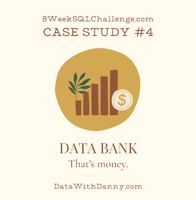
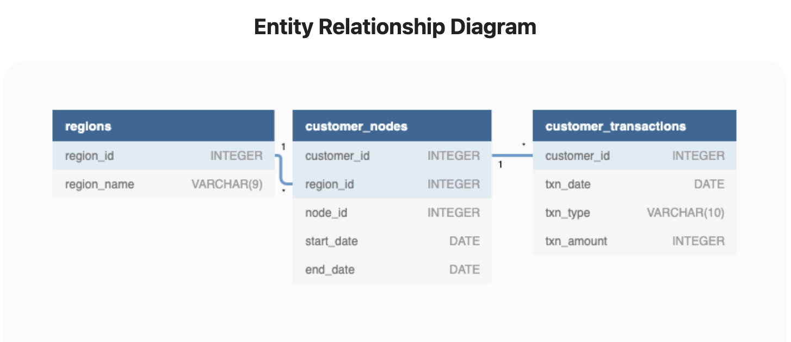

# September 29 - Data Bank


## Business Problem
Danny needs help analyzing the data from his digital bank. He wants to know about his customer distribution across the globe, and customer transactions.

## Tables and Data Structure


## Question and Solution
All queries are written in PostgreSQL.

Copy the solution code and execute on [DB Fiddle](https://www.db-fiddle.com/f/2GtQz4wZtuNNu7zXH5HtV4/3) to see the results!
***
### Case Study Questions
Part A: Customer Nodes Exploration
1. How many unique nodes are there on the Data Bank system?
```sql
SELECT
    COUNT(DISTINCT node_id)
FROM
    customer_nodes;
```
Output:
| count |
| ----- |
| 5     |

5 unique nodes total.
***
2. What is the number of nodes per region?
```sql
SELECT
    c.region_id,
    r.region_name,
    COUNT(DISTINCT c.node_id) AS node_count
FROM
	customer_nodes c
INNER JOIN
	regions r
    ON c.region_id=r.region_id
GROUP BY
	c.region_id, r.region_name;
```
__Explanation:__
* Count the number of distinct nodes and group them by region.

Output:
| region_id | region_name | node_count |
| --------- | ----------- | ---------- |
| 1         | Australia   | 5          |
| 2         | America     | 5          |
| 3         | Africa      | 5          |
| 4         | Asia        | 5          |
| 5         | Europe      | 5          |

All regions have 5 distinct nodes.
***
3. How many customers are allocated to each region?
```sql
SELECT
	c.region_id,
	r.region_name,
	COUNT(DISTINCT c.customer_id) AS customer_count
FROM
	customer_nodes c
INNER JOIN
	regions r
    ON c.region_id=r.region_id
GROUP BY
	c.region_id, r.region_name;
```
__Explanation:__
* Count the number of distinct customers and group by region.

Output:
| region_id | region_name | customer_count |
| --------- | ----------- | -------------- |
| 1         | Australia   | 110            |
| 2         | America     | 105            |
| 3         | Africa      | 102            |
| 4         | Asia        | 95             |
| 5         | Europe      | 88             |

The distribution of customers is quite even, with most having a value close to 100 customers.
***
4. How many days on average are customers reallocated to a different node?

* Defining days reallocated as start_dates where customers are allocated to a node different from their previous one.
```sql
WITH compare_to_prev AS (
SELECT
	c.customer_id,
  	r.region_id,
  	r.region_name,
  	c.node_id,
  	c.start_date,
  	c.end_date,
    LAG(c.node_id) OVER (PARTITION BY c.customer_id ORDER BY c.start_date) AS prev_node
FROM
	customer_nodes c
INNER JOIN
	regions r
    ON c.region_id=r.region_id
    )
, days_reallocated AS (
SELECT
	customer_id,
	SUM(CASE 
        	WHEN (node_id != prev_node AND prev_node IS NOT NULL) THEN 1 
        	ELSE 0 
        END) AS node_change
FROM
	compare_to_prev
GROUP BY
	customer_id
)
SELECT
	ROUND(AVG(node_change)) AS avg_days
FROM
	days_reallocated;
```
__Explanation:__
* Create a CTE `compare_to_prev` with a new column `prev_node` created using LAG() to find the previous node_id for each entry for every customer, ordered by ascending start_date.
* Create another CTE `days_reallocated` to calculate the SUM of rows where `node_id` is different from `prev_node`, excluding the first row whose `prev_node` is null. Group the result by `customer_id` and name the new column `node_change`.
* Select the average of `node_change`, rounded to the nearest integer.

Output:
| avg_days |
| -------- |
| 5        |

On average, a customer can expect to be reallocated to a different node on 5 days.
***
5. What is the median, 80th and 95th percentile for this same reallocation days metric for each region?
```sql
WITH compare_to_prev AS (
SELECT
	c.customer_id,
  	r.region_id,
  	r.region_name,
  	c.node_id,
  	c.start_date,
  	c.end_date,
    LAG(c.node_id) OVER (PARTITION BY c.customer_id ORDER BY c.start_date) AS prev_node
FROM
	customer_nodes c
INNER JOIN
	regions r
    ON c.region_id=r.region_id
    )
, days_reallocated AS (
SELECT
  	customer_id,
	region_id,
  	region_name,
	SUM(CASE 
        	WHEN (node_id != prev_node AND prev_node IS NOT NULL) THEN 1 
        	ELSE 0 
        END) AS node_change
FROM
	compare_to_prev
GROUP BY
	customer_id, region_id, region_name
    )
SELECT
	region_id,
	region_name,
    PERCENTILE_DISC(0.50) WITHIN GROUP (ORDER BY node_change) AS median,
    PERCENTILE_DISC(0.80) WITHIN GROUP (ORDER BY node_change) AS eightieth_percentile,
    PERCENTILE_DISC(0.95) WITHIN GROUP (ORDER BY node_change) AS ninetyfifth_percentile
FROM
	days_reallocated
GROUP BY
	region_id, region_name;
```
__Explanation:__
* Re-use the same CTEs from the previous question. This time, instead of calculating the rounded average, use PERCENTILE_DISC() with values of 0.5, 0.8 and 0.95 to find the 50th percentile (median), 80th percentile and 95th percentile respectively. Group the result by region.

Output:
| region_id | region_name | median | eightieth_percentile | ninetyfifth_percentile |
| --------- | ----------- | ------ | -------------------- | ---------------------- |
| 1         | Australia   | 5      | 6                    | 6                      |
| 2         | America     | 5      | 6                    | 6                      |
| 3         | Africa      | 5      | 6                    | 6                      |
| 4         | Asia        | 5      | 6                    | 6                      |
| 5         | Europe      | 5      | 6                    | 6                      |

The statistics for all regions are identical. 
***
Part B: Customer Transactions
1. What is the unique count and total amount for each transaction type?
```sql
SELECT
	txn_type,
    COUNT(*) AS total_count,
    SUM(txn_amount) AS total_amount
FROM
	customer_transactions
GROUP BY
	txn_type;
```
__Explanation:__
* Select the total COUNT of transactions and the SUM of amount, grouoping by transaction type (`txn_type`).

Output:
| txn_type   | total_count | total_amount |
| ---------- | ----------- | ------------ |
| purchase   | 1617        | 806537       |
| deposit    | 2671        | 1359168      |
| withdrawal | 1580        | 793003       |

The most performed operation is deposit, which has the highest total dollar amount as well.
***
2. What is the average total historical deposit counts and amounts for all customers?
```sql
WITH historical_deposit AS (
SELECT
  	customer_id,
  	COUNT(*) AS num_deposits,
  	SUM(txn_amount) AS total_deposit_amount
FROM
  	customer_transactions
WHERE
  	txn_type = 'deposit'
GROUP BY
  	customer_id
)
SELECT
	ROUND(AVG(num_deposits)) AS average_deposit_count,
    ROUND(AVG(total_deposit_amount)) AS average_deposit_amount
FROM
	historical_deposit;
```
__Explanation:__
* Create a CTE `historical_deposit`, which contains the total number of deposits and total deposit amount for each customer. 
* Select the average number of deposit and the average of the total deposit amount from `historical_deposit`, rounded to the nearest integer.

Output:
| average_deposit_count | average_deposit_amount |
| --------------------- | ---------------------- |
| 5                     | 2718                   |

The average deposit amount for each customer is 5, which the average deposit amount being $2718.
***
3. For each month - how many Data Bank customers make more than 1 deposit and either 1 purchase or 1 withdrawal in a single month?
```sql
WITH processed AS (
SELECT
	EXTRACT(MONTH FROM txn_date) AS txn_month,
    customer_id,
    SUM(CASE WHEN txn_type = 'deposit' THEN 1 ELSE 0 END) AS deposit_count,
    SUM(CASE WHEN txn_type = 'purchase' THEN 1 ELSE 0 END) AS purchase_count,
    SUM(CASE WHEN txn_type = 'withdrawal' THEN 1 ELSE 0 END) AS withdrawal_count
FROM
	customer_transactions
GROUP BY
	txn_month, customer_id
)
SELECT
	txn_month,
    COUNT(DISTINCT customer_id) AS customer_count
FROM
	processed
WHERE
	deposit_count > 1 
    AND (purchase_count = 1 OR withdrawal_count = 1)
GROUP BY
	txn_month;
```
__Explanation:__
* Create a CTE `processed` with the column `txn_month`, created by using EXTRACT() to get the month from `txn_date`, and the columns `deposit_count`, `puchase_count` and `withdrawal_count`, created by using SUM to find the count of each transaction type.
* From the CTE `processed`, select the total customer count with a `deposit_count` greater than 1, and a either a `purchase_count` equal to 1 or a `withdrawal_count` equal to 1.

Output:
| txn_month | customer_count |
| --------- | -------------- |
| 1         | 115            |
| 2         | 108            |
| 3         | 113            |
| 4         | 50             |
***
4. What is the closing balance for each customer at the end of the month?
```sql
WITH month1 AS (
SELECT
  	c1.customer_id,
  	CASE 
  		WHEN (SELECT 
              	COUNT(*) 
              FROM 
              	customer_transactions c2
              WHERE 
              	c2.customer_id = c1.customer_id 
              	AND EXTRACT(MONTH FROM c2.txn_date) = 1
              ) = 0 THEN 0
  		ELSE
  			SUM(CASE WHEN c1.txn_type = 'deposit' THEN c1.txn_amount ELSE -c1.txn_amount END)
    END AS balance
FROM
  	customer_transactions c1
WHERE
  	EXTRACT(MONTH FROM c1.txn_date) = 1
GROUP BY
  	c1.customer_id
    )
, month2 AS (
SELECT
  	c1.customer_id,
  	CASE 
  		WHEN (SELECT 
              	COUNT(*) 
              FROM 
              	customer_transactions c2
              WHERE 
              	c2.customer_id = c1.customer_id 
              	AND EXTRACT(MONTH FROM c2.txn_date) = 2
              ) = 0 THEN 0
  		ELSE
  			SUM(CASE WHEN c1.txn_type = 'deposit' THEN c1.txn_amount ELSE -c1.txn_amount END)
    END + (SELECT
      			balance 
           FROM 
           		month1 m 
           WHERE 
           		m.customer_id = c1.customer_id) AS balance
FROM
  	customer_transactions c1
WHERE
  	EXTRACT(MONTH FROM c1.txn_date) = 2
GROUP BY
  	c1.customer_id
    )
, month3 AS (
SELECT
  	c1.customer_id,
  	CASE 
  		WHEN (SELECT 
              	COUNT(*) 
              FROM 
              	customer_transactions c2
              WHERE 
              	c2.customer_id = c1.customer_id 
              	AND EXTRACT(MONTH FROM c2.txn_date) = 3
              ) = 0 THEN 0
  		ELSE
  			SUM(CASE WHEN c1.txn_type = 'deposit' THEN c1.txn_amount ELSE -c1.txn_amount END)
    END + (SELECT
      			balance 
           FROM 
           		month2 m 
           WHERE 
           		m.customer_id = c1.customer_id) AS balance
FROM
  	customer_transactions c1
WHERE
  	EXTRACT(MONTH FROM c1.txn_date) = 3
GROUP BY
  	c1.customer_id
    )
, month4 AS (
SELECT
  	c1.customer_id,
  	CASE 
  		WHEN (SELECT 
              	COUNT(*) 
              FROM 
              	customer_transactions c2
              WHERE 
              	c2.customer_id = c1.customer_id 
              	AND EXTRACT(MONTH FROM c2.txn_date) = 4
              ) = 0 THEN 0
  		ELSE
  			SUM(CASE WHEN c1.txn_type = 'deposit' THEN c1.txn_amount ELSE -c1.txn_amount END)
    END + (SELECT
      			balance 
           FROM 
           		month3 m 
           WHERE 
           		m.customer_id = c1.customer_id) AS balance
FROM
  	customer_transactions c1
WHERE
  	EXTRACT(MONTH FROM c1.txn_date) = 4
GROUP BY
  	c1.customer_id
    )
SELECT
	month1.customer_id,
    month1.balance AS month1_balance,
    month2.balance-month1.balance AS month1_to_month2_change,
    month2.balance AS month2_balance,
    month3.balance-month2.balance AS month2_to_month3_change,
    month3.balance AS month3_balance,
    month4.balance-month3.balance AS month3_to_month4_change,
    month4.balance AS month4_balance
FROM
	month1
INNER JOIN
	month2
    ON month1.customer_id = month2.customer_id
INNER JOIN
	month3
    ON month1.customer_id = month3.customer_id
INNER JOIN
	month4
    ON month1.customer_id = month4.customer_id
LIMIT 50;
```
__Explanation:__
* Create 4 CTEs `month1`, `month2`, `month3`, `month4`, each detailing the closing balance of each customer at the end of each month. Months after `month1` need to sum to the balance of the previous month to get the accurate, cumulative sum.
* Join all 4 CTEs together and select the end of month balance for each month for all customers, as well as the change in balance between each adjacent month.

Output:
| customer_id | month1_balance | month1_to_month2_change | month2_balance | month2_to_month3_change | month3_balance | month3_to_month4_change | month4_balance |
| ----------- | -------------- | ----------------------- | -------------- | ----------------------- | -------------- | ----------------------- | -------------- |
| 3           | 144            | -965                    | -821           | -401                    | -1222          | 493                     | -729           |
| 7           | 964            | 2209                    | 3173           | -640                    | 2533           | 90                      | 2623           |
| 8           | 587            | -180                    | 407            | -464                    | -57            | -972                    | -1029          |
| 9           | 849            | -195                    | 654            | 930                     | 1584           | -722                    | 862            |
| 10          | -1622          | 280                     | -1342          | -1411                   | -2753          | -2337                   | -5090          |
| 11          | -1744          | -725                    | -2469          | 381                     | -2088          | -328                    | -2416          |
| 16          | -1341          | -1552                   | -2893          | -1391                   | -4284          | 862                     | -3422          |
| 18          | 757            | -1181                   | -424           | -418                    | -842           | 27                      | -815           |
| 19          | -12            | -239                    | -251           | -50                     | -301           | 343                     | 42             |
| 21          | -204           | -560                    | -764           | -1110                   | -1874          | -1379                   | -3253          |
| 22          | 235            | -1274                   | -1039          | 890                     | -149           | -1209                   | -1358          |
| 23          | 94             | -408                    | -314           | 158                     | -156           | -522                    | -678           |
| 25          | 174            | -574                    | -400           | -820                    | -1220          | 916                     | -304           |
| 26          | 638            | -669                    | -31            | -591                    | -622           | -1248                   | -1870          |
| 28          | 451            | -1269                   | -818           | -410                    | -1228          | 1500                    | 272            |
| 29          | -138           | 62                      | -76            | 907                     | 831            | -1379                   | -548           |
| 32          | -89            | 465                     | 376            | -1219                   | -843           | -158                    | -1001          |
| 33          | 473            | -589                    | -116           | 1341                    | 1225           | -236                    | 989            |
| 36          | 149            | 141                     | 290            | 751                     | 1041           | -614                    | 427            |
| 37          | 85             | 817                     | 902            | -1971                   | -1069          | 110                     | -959           |
| 38          | 367            | -832                    | -465           | -333                    | -798           | -448                    | -1246          |
| 39          | 1429           | 959                     | 2388           | 72                      | 2460           | 56                      | 2516           |
| 40          | 347            | -52                     | 295            | 364                     | 659            | -867                    | -208           |
| 41          | -46            | 1425                    | 1379           | 2062                    | 3441           | -916                    | 2525           |
| 42          | 447            | 620                     | 1067           | -1954                   | -887           | -999                    | -1886          |
| 43          | -201           | -205                    | -406           | 1275                    | 869            | -324                    | 545            |
| 46          | 522            | 866                     | 1388           | -1308                   | 80             | 24                      | 104            |
| 47          | -1153          | -130                    | -1283          | -1579                   | -2862          | -307                    | -3169          |
| 50          | 931            | -1605                   | -674           | 949                     | 275            | 175                     | 450            |
| 51          | 301            | -398                    | -97            | 876                     | 779            | 585                     | 1364           |
| 53          | 22             | 188                     | 210            | -938                    | -728           | 955                     | 227            |
| 54          | 1658           | -29                     | 1629           | -1096                   | 533            | 435                     | 968            |
| 55          | 380            | -790                    | -410           | 759                     | 349            | -862                    | -513           |
| 56          | -67            | -1579                   | -1646          | -429                    | -2075          | -1791                   | -3866          |
| 58          | 383            | 1314                    | 1697           | -2893                   | -1196          | 561                     | -635           |
| 59          | 924            | 1266                    | 2190           | -538                    | 1652           | -854                    | 798            |
| 60          | -189           | 857                     | 668            | -1413                   | -745           | -424                    | -1169          |
| 61          | 222            | 101                     | 323            | -2033                   | -1710          | -527                    | -2237          |
| 67          | 1593           | 972                     | 2565           | -515                    | 2050           | -828                    | 1222           |
| 69          | 23             | -1967                   | -1944          | -394                    | -2338          | -747                    | -3085          |
| 72          | 796            | -1599                   | -803           | -877                    | -1680          | -647                    | -2327          |
| 78          | 694            | -1456                   | -762           | 45                      | -717           | -259                    | -976           |
| 80          | 795            | 395                     | 1190           | -568                    | 622            | -423                    | 199            |
| 81          | 403            | -1360                   | -957           | -149                    | -1106          | -878                    | -1984          |
| 82          | -3912          | -74                     | -3986          | 737                     | -3249          | -1365                   | -4614          |
| 83          | 1099           | -1791                   | -692           | -50                     | -742           | 365                     | -377           |
| 87          | -365           | -1001                   | -1366          | -197                    | -1563          | 368                     | -1195          |
| 88          | -35            | 787                     | 752            | -1488                   | -736           | -84                     | -820           |
| 89          | 210            | -1889                   | -1679          | -974                    | -2653          | -494                    | -3147          |
| 90          | 1772           | -3007                   | -1235          | -389                    | -1624          | -222                    | -1846          |
***
Note: The context of this case study is sourced from the [challenge website](https://8weeksqlchallenge.com/case-study-4/) by Danny Ma.