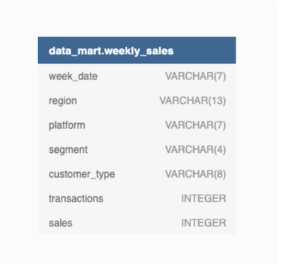

# October 7 - Data Mart


## Business Problem
Danny needs help analyzing the sales performance of his online supermarket.

## Tables and Data Structure


## Question and Solution
All queries are written in PostgreSQL.

***
### Case Study Questions
Part A: Data Cleaning

__Cleaning Tasks:__
1. Convert the `week_date` to a DATE format
2. Add a `week_number` as the second column for each `week_date` value
3. Add a `month_number` with the calendar month for each `week_date` value as the 3rd column
4. Add a `calendar_year` column as the 4th column containing either 2018, 2019 or 2020 values
5. Add a new column called `age_band` after the original `segment` column using the following mapping on the number inside the `segment` value.
    - 1: Young Adults
    - 2: Middle Aged
    - 3 or 4: Retirees 
6. Add a new `demographic` column using the following mapping for the first letter in the `segment` values, shown below.
    - C: Couples
    - F: Families
7. Ensure all null string values with an "unknown" string value in the original `segment` column as well as the new `age_band` and `demographic` columns
8. Generate a new `avg_transaction` column as the `sales` value divided by `transactions` rounded to 2 decimal places for each record
```sql
CREATE TEMP TABLE clean_weekly_sales AS (
WITH base AS (
SELECT
  	TO_DATE(week_date, 'DD-MM-YY') AS week_date,
  	region AS region,
  	platform AS platform,
  	CASE
  		WHEN segment = 'null' THEN 'unknown'
  		ELSE segment
  	END AS segment,
  	customer_type AS customer_type,
  	transactions AS transactions,
  	sales AS sales
FROM
  	data_mart.weekly_sales
)
SELECT
  	week_date AS week_date,
    EXTRACT(WEEK FROM week_date) AS week_number,
    EXTRACT(MONTH FROM week_date) AS month_number,
    EXTRACT(YEAR FROM week_date) AS calendar_year,
  	region AS region,
  	platform AS platform,
  	segment AS segment,
    CASE
    	WHEN segment = 'unknown' THEN segment
    	WHEN segment ~ '[a-zA-Z]*1' THEN 'Young Adults'
        WHEN segment ~ '[a-zA-Z]*2' THEN 'Middle Aged'
        ELSE 'Retirees'
    END AS age_band,
    CASE
    	WHEN segment = 'unknown' THEN segment
    	WHEN segment ~ 'C' THEN 'Couples'
        ELSE 'Families'
    END AS demographic,
  	customer_type AS customer_type,
  	transactions AS transactions,
  	sales AS sales,
    ROUND(sales/transactions, 2) AS avg_transaction
FROM
  	base
ORDER BY
	week_date ASC
)
```
__Explanation:__
* Create a CTE base to handle correct data types formatting and null values. From this CTE, create the new table clean_weekly_sales.
* EXTRACT to find week_number, month_number and calendar_year.
* CASE WHEN to find the age_group and demographic
* Round the average transaction value to 2 decimal places.
***
Part B: Data Exploration

1. What day of the week is used for each week_date value?

| week_date  | day |
| ---------- | --- |
| 2018-03-26 | Mon |
| 2018-04-02 | Mon |
| 2018-04-09 | Mon |
| 2018-04-16 | Mon |
| 2018-04-23 | Mon |
| 2018-04-30 | Mon |
| 2018-05-07 | Mon |
| 2018-05-14 | Mon |
| 2018-05-21 | Mon |
| 2018-05-28 | Mon |
| 2018-06-04 | Mon |
| 2018-06-11 | Mon |
| 2018-06-18 | Mon |
| 2018-06-25 | Mon |
| 2018-07-02 | Mon |
| 2018-07-09 | Mon |
| 2018-07-16 | Mon |
| 2018-07-23 | Mon |
| 2018-07-30 | Mon |
| 2018-08-06 | Mon |
| 2018-08-13 | Mon |
| 2018-08-20 | Mon |
| 2018-08-27 | Mon |
| 2018-09-03 | Mon |
| 2019-03-25 | Mon |
| 2019-04-01 | Mon |
| 2019-04-08 | Mon |
| 2019-04-15 | Mon |
| 2019-04-22 | Mon |
| 2019-04-29 | Mon |
| 2019-05-06 | Mon |
| 2019-05-13 | Mon |
| 2019-05-20 | Mon |
| 2019-05-27 | Mon |
| 2019-06-03 | Mon |
| 2019-06-10 | Mon |
| 2019-06-17 | Mon |
| 2019-06-24 | Mon |
| 2019-07-01 | Mon |
| 2019-07-08 | Mon |
| 2019-07-15 | Mon |
| 2019-07-22 | Mon |
| 2019-07-29 | Mon |
| 2019-08-05 | Mon |
| 2019-08-12 | Mon |
| 2019-08-19 | Mon |
| 2019-08-26 | Mon |
| 2019-09-02 | Mon |
| 2020-03-23 | Mon |
| 2020-03-30 | Mon |
| 2020-04-06 | Mon |
| 2020-04-13 | Mon |
| 2020-04-20 | Mon |
| 2020-04-27 | Mon |
| 2020-05-04 | Mon |
| 2020-05-11 | Mon |
| 2020-05-18 | Mon |
| 2020-05-25 | Mon |
| 2020-06-01 | Mon |
| 2020-06-08 | Mon |
| 2020-06-15 | Mon |
| 2020-06-22 | Mon |
| 2020-06-29 | Mon |
| 2020-07-06 | Mon |
| 2020-07-13 | Mon |
| 2020-07-20 | Mon |
| 2020-07-27 | Mon |
| 2020-08-03 | Mon |
| 2020-08-10 | Mon |
| 2020-08-17 | Mon |
| 2020-08-24 | Mon |
| 2020-08-31 | Mon |

From the results above, it can be seen data entries are recorded every Monday.
***
2. What range of week numbers are missing from the dataset?

| range   |
| ------- |
| 1 - 12  |
| 37 - 52 |

Data is recorded during months March to September.
***
3. How many total transactions were there for each year in the dataset?

| calendar_year | million_transactions |
| ------------- | -------------------- |
| 2018          | 346.41               |
| 2019          | 365.64               |
| 2020          | 375.81               |

Years 2019 and 2020 have the most transactions, with a significant jump of ~20 million occurring between 2018 and 2019.
***
4. What is the total sales for each region for each month?

| month_number | million_dollars_in_asia | million_dollars_in_usa | million_dollars_in_canada | million_dollars_in_europe | million_dollars_in_africa | million_dollars_in_oceania | million_dollars_in_south_america |
| ------------ | ----------------------- | ---------------------- | ------------------------- | ------------------------- | ------------------------- | -------------------------- | -------------------------------- |
| 3            | 529.77                  | 225.35                 | 144.63                    | 35.34                     | 567.77                    | 783.28                     | 71.02                            |
| 4            | 1804.63                 | 759.79                 | 484.55                    | 127.33                    | 1911.78                   | 2599.77                    | 238.45                           |
| 5            | 1526.29                 | 655.97                 | 412.38                    | 109.34                    | 1647.24                   | 2215.66                    | 201.39                           |
| 6            | 1619.48                 | 703.88                 | 443.85                    | 122.81                    | 1767.56                   | 2371.88                    | 218.25                           |
| 7            | 1768.84                 | 760.33                 | 477.13                    | 136.76                    | 1960.22                   | 2563.46                    | 235.58                           |
| 8            | 1663.32                 | 712.00                 | 447.07                    | 122.10                    | 1809.60                   | 2432.31                    | 221.17                           |
| 9            | 252.84                  | 110.53                 | 69.07                     | 18.88                     | 276.32                    | 372.47                     | 34.18                            |
***
5. What is the total count of transactions for each platform

| platform | million_transactions |
| -------- | -------------------- |
| Retail   | 1081.93              |
| Shopify  | 5.93                 |
***
6. What is the percentage of sales for Retail vs Shopify for each month?

| month_number | retail_percentage | shopify_percentage |
| ------------ | ----------------- | ------------------ |
| 3            | 97.54             | 2.46               |
| 4            | 97.59             | 2.41               |
| 5            | 97.30             | 2.70               |
| 6            | 97.27             | 2.73               |
| 7            | 97.29             | 2.71               |
| 8            | 97.08             | 2.92               |
| 9            | 97.38             | 2.62               |

The percentage distribution is quite uniform across the months, retaining a consistent 97% proportion for retail and 2% for shopify.
***
7. What is the percentage of sales by demographic for each year in the dataset?

| calendar_year | family_percentage | couple_percentage | unknown_percentage |
| ------------- | ----------------- | ----------------- | ------------------ |
| 2018          | 31.99             | 26.38             | 41.63              |
| 2019          | 32.47             | 27.28             | 40.25              |
| 2020          | 32.73             | 28.72             | 38.55              |

The "unknown" demographic makes up the majority percentage of salses for every year. Thus, it is suggested to begin collecting demographic data outside families and couples.
***
8. Which age_band and demographic values contribute the most to Retail sales?

| age_band     | demographic | retail_sales_in_millions | percentage_of_total |
| ------------ | ----------- | ------------------------ | ------------------- |
| unknown      | unknown     | 16067.29                 | 40.10               |
| Retirees     | Families    | 6634.69                  | 16.57               |
| Retirees     | Couples     | 6370.58                  | 16.03               |
| Middle Aged  | Families    | 4354.09                  | 11.18               |
| Young Adults | Couples     | 2602.92                  | 6.58                |
| Middle Aged  | Couples     | 1854.16                  | 4.89                |
| Young Adults | Families    | 1770.89                  | 4.66                |

The "unknown" age group and "unknown" demographic combination make up the majority percentage of total retail sales. This highlights the need to expand data collection outside of existing age group and demographic categories.
***
9. Can we use the avg_transaction column to find the average transaction size for each year for Retail vs Shopify? If not - how would you calculate it instead?

| calendar_year | avg_transaction_retail | avg_transaction_shopify |
| ------------- | ---------------------- | ----------------------- |
| 2019          | 36.83                  | 183.36                  |
| 2018          | 36.56                  | 192.48                  |
| 2020          | 36.56                  | 179.03                  |

No, we cannot use the avg_transaction column to calculate average transaction for each year. The logic: assume the year 2018 has 2 records, a net sale of 8 dollars across 4 transactions and ten dollars across 4 transactions respectively. If using avg_transaction: 8/4 + 10/4 = 4.5 dollars per transaction. The true value: 18/8 = 2.25 dollars per transaction.
***
Note: The context of this case study is sourced from the [challenge website](https://8weeksqlchallenge.com/case-study-5/) by Danny Ma.