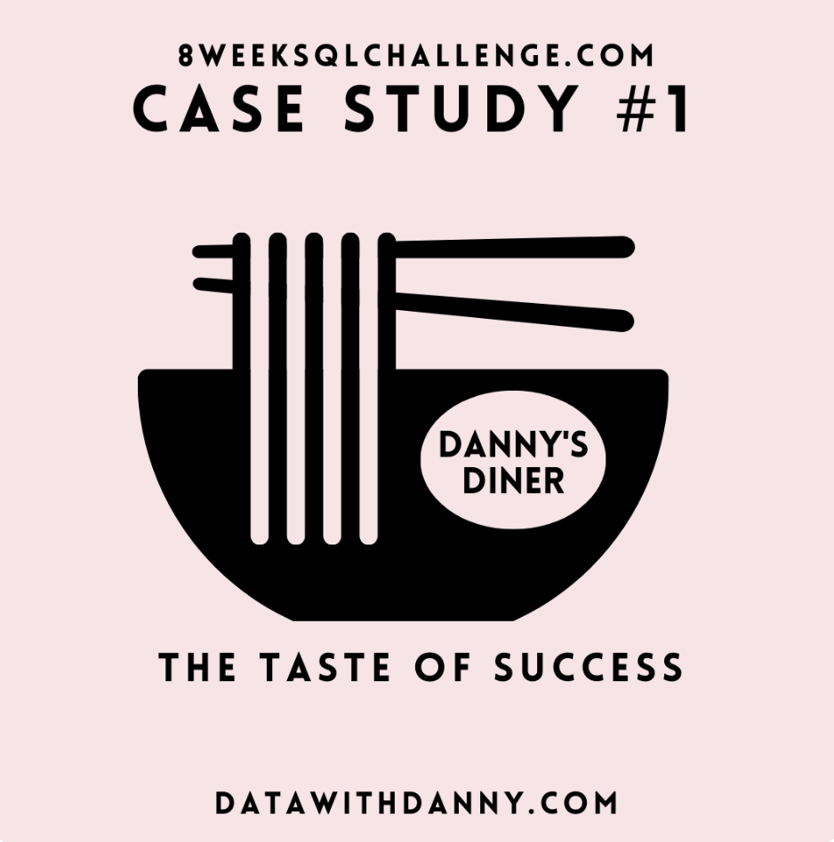

### September 5 - Danny's Diner


## Business Problem
Danny's new restaurant has been operating for a few months. He wants to know if he should expand the current customer loyalty program, aiming to deliver a better and more personalized experience for his loyal customers.

## Tables & Data Structure

```sql -- Add 3 backticks followed by sql
TABLE sales {
  "customer_id" VARCHAR(1) -- foreign key (members)
  "order_date" DATE
  "product_id" INTEGER -- foreign key (menu)
}

TABLE menu {
  "product_id" INTEGER -- primary key
  "product_name" VARCHAR(5)
  "price" INTEGER
}

TABLE members {
  "customer_id" VARCHAR(1) -- primary key
  "join_date" TIMESTAMP
}
``` -- Add 3 backticks

